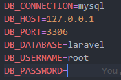
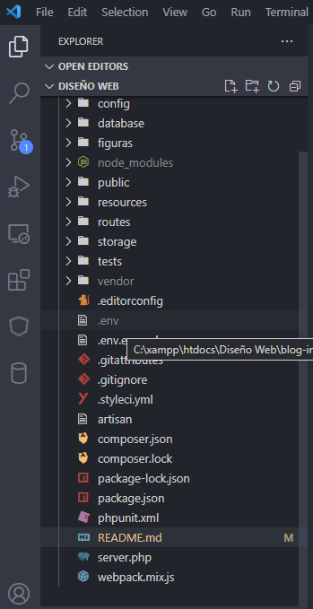
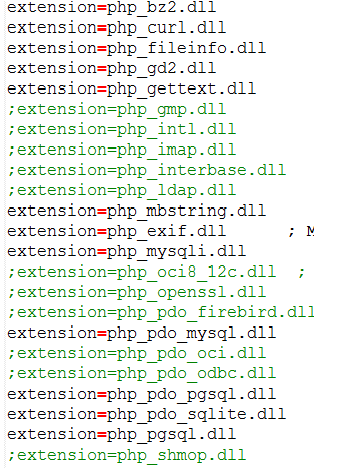
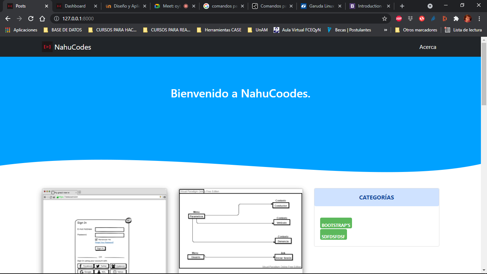

# Diseño y Aplicaciones en la web 


## Trabajo de investigación: 

    Tema a elección

## Grupo

    Wagner Nahuel


## Tema a investigar

    El tema propuesto para el trabajo de invesigación fue hacer un blog, el cual tendra las sigientes caracteristicas.

## Caracteristicas

La pagina web tendra dos secciones una parte sera la web en si donde se podran ver las publicaciones, detalles de los posts, categorías y etiquetas. 

Ademas se podran realizar comentarios sobre cada post.
En el panel administrativo nos encontraremos con las siguientes caracteristicas:

- Un panel donde se veran todas las secciones del administrador.
- Categorías, en esta sección se podra ver una lista con las categorias, podremos crear nuevas y agregar una descripción.
- Etiquetas, en esta sección se podra ver una lista con las etiquetas, podremos crear nuevas y agregar una descripción.
- Posts, en esta sección se podra ver una lista con todos los posts, podremos editar, crear y eliminar las publicaciones.
- Ver los usuarios que tenemos en el sistema, solo se permitira un usuario administrador, por este motivio no se podran realizar registros de nuevos usuarios.
- Ver el perfil del usuario administrador, con todos sus datos.

    
---
## Tecnologías 

Las tecnologías y frameworcks porpuestos para este trabajo fueron las siguientes:

  - Tailwindcss y/o bootstrap como framework para el Front-End.
  - Laravel como framework para el Back-End.
  - PostgresSQL como base de datos.
  - pgAdmin como gestor de Bases de Datos.
  - AdminLTE version 3.0.0 para el panel administrador de la pagina web

---
## Analisis de dominio.

La pagina web esta diseñada para poder compartir información de interes a los lectores.

---
## Acerca de este Proyecto

A continuacion se estara indicando como usar y que se debe de hacer para poder usar y correr esta web de manera local en Windows o en Linux.

**Paso 1:** Tener descargado un servidor, como ser xampp. Descargar esta versión 7.3.28 / PHP 7.3.28

Link de descarga:
    
- https://www.apachefriends.org/download.html

**Paso 2:** Tener desacargado composer el cual es un manejador de dependencias para php, descargarlo e instalaro de manera global para todos los usuarios. 

Link de descarga: 

- https://getcomposer.org/download/

**Paso 3:** Descargar postgresql-9.4.26 el cual ya viene incluido con PgAdmin en su versión III, es un gestor de bases de datos.
Descargar la version postgresql-9.4.26-1-windows-x64.

Link de descarga:
- https://www.postgresql.org/download/windows/


Despues de haber descargado e instalado las tecnologías mencionadas en los pasos anteriores, debemos de realizar estos pasos.

**Paso 4:** Dirijirse a este link para descargar o clonar el proyecto desde el repositorio el cual está en GitHub:

Enlace:
- https://github.com/Nahuelito97/blog

**Paso 5:** Una ves descargado el proyecto, debemos de colocarlo en nuestro servidor, en este caso xammp, dirijirse a la siguiente ruta:
    
    c/xampp/htdocs/

**Paso 6:** Crear una base de datos en postgres.

**Paso 7:** 
- Abrir la carpeta del proyecto con un editor de código.
- Cambiar el nombre del archivo ".env.example" por ".env".
- En el archivo .env modificar los siguiente:
  
    

    por esto

    

    par poder correr este proyecto.
    
- Abrir una consola en el editror de código y ejecutar los siguientes comandos:
    ```bash
    # instala las dependencias de composer
    composer install

    # comentar esto en AppServiceProvider.php
    // $categories = Category::take(5)->get();
    // View::share('categories', $categories);
    
    #actualizar composer
    composer update
    composer dump-autoload

    #generar la clave de la aplicación
    php artisan key:generate

    #migrar las tablas a la base de datos y genera los seeders
    php artisan migrate --seed

    # abiliatar base dedatos query en AppServiceProvider.php 
    $categories = Category::take(5)->get();
    View::share('categories', $categories);

   

    #para ejecutar la aplicación 
    php artisan serve
    ``` 
- Luego de haber ejecutdo todos estos comandos, ingresar desde el navegador a http://127.0.0.1:8000/


---
# Investigación para poder usar postgreSQL como base de datos para poder crear un blog, usando bootstap


**Paso 1:** En el editor de código lo primero es ir al archivo .env ubicado en la raíz de nuestro proyecto.



Ya en el archivo se deben de cambiar los parámetros de la base de datos a la cual deseamos tener la conexión.


Despues de haber cambiado nuestra configuración debemos de dirigirnos al siguiente Archivo "database.php" ubicado en la siguiente Ruta: "Config > database.php" en ese archivo debemos de buscar y reemplazar los siguientes parametros.

    'default'=>env('BD_CONNECTION','pgsql'),
una ves finalizado el cambio en nuestro php.ini debemos de habilitar los drivers de conexion de php para Postgres.



debemos de habilitar los siguientes:            

- php_pdo_pgsql
- php_pgsql

Luego en la consola finalizamos limpiando la cache:
```bash
    composer dump-autoload

    php artisan view:clear

    php artisan cache:clear

    php artisan migrate
```

Para poder utilizar bootstrap debemos de dirijirnos a la web en el siguiente enlace:

- https://getbootstrap.com/docs/4.6/getting-started/introduction/


Dirijirse a la pagina de bootstrap y copiar los CDNS de los archivos css y js.

## Laravel

El marco PHP para artesanos web
Laravel es un marco de aplicación web con una sintaxis elegante y expresiva. Ya hemos sentado las bases, permitiéndole crear sin preocuparse por las pequeñas cosas.

## Esta captura muestra una parte del sitio desarrollado con Bootstrap.





 

<span class="badge badge-warning text-uppercase">Nahuel Wagner</span>
